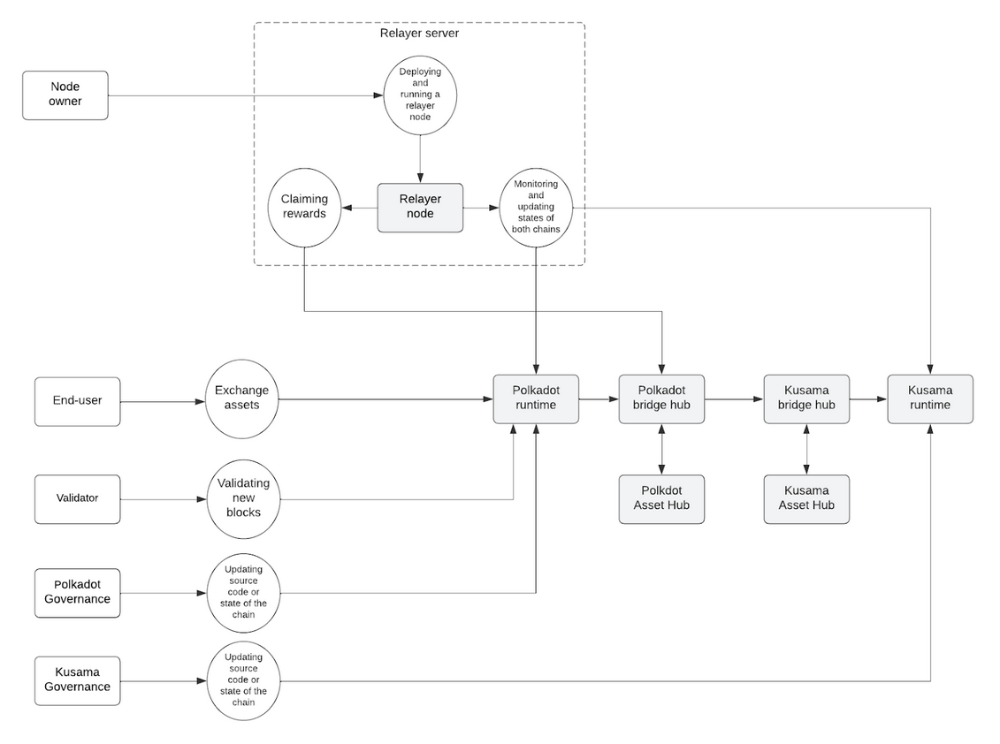
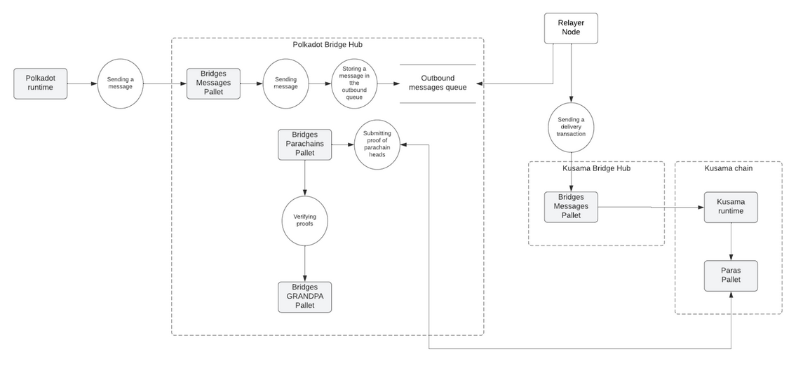
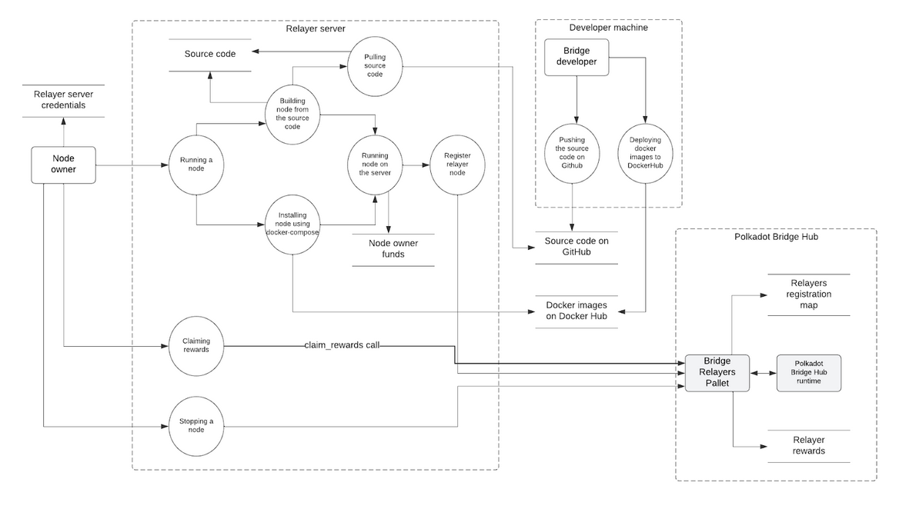
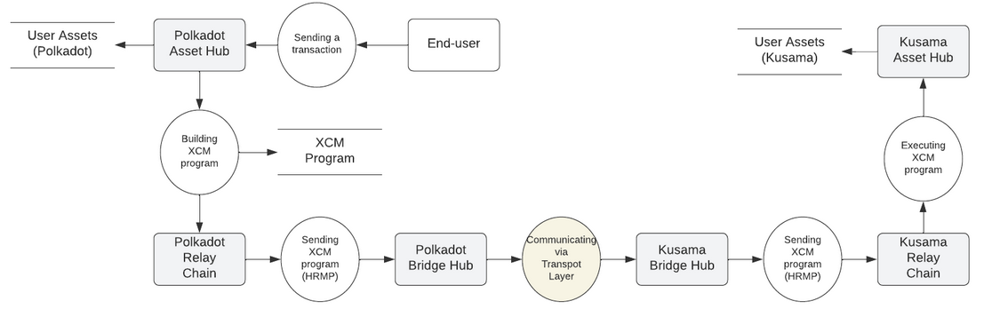

# Polkadot / Kusama Bridge Threat Model

## Executive Summary

A security risk assessment of the Polkadot \<\> Kusama bridge (P\<\>K bridge) was conducted in June 2023 by the Security team to formalize the risk position of this key application within our organization.

The Polkadot \<\> Kusama bridge provides a trustless, decentralized connection between the Polkadot and Kusama chains. A blockchain bridge is a technology or protocol that enables interoperability between two or more separate blockchain networks, allowing for the transfer of digital assets or information across different platforms, each with unique rules, consensus mechanisms, and protocols.

### Scope of the Review

- Created an overview of the components related to bridges
- Assessed possible risks
- Conducted a review of dependencies

The business owner of the bridges project is the Bridges team.

Following our review, we concluded that compromising the security of bridges would have far-reaching effects for Parity. We assigned a risk category of High. Any vulnerabilities related to the language implementation affect all the parachains in the ecosystem that support smart contracts; therefore, it’s essential to check its security carefully.

A detailed risk analysis was conducted based on the identification and analysis of system-specific security risks, considering the business environment, technologies used, processes, and practices implemented. We started from a universe of 52 potential risk scenarios and identified six key categories of IT Security risk, with a maximum risk level of High. The risk evaluation summary is presented in Table 1.

#### Table 1 – Risk Evaluation Summary

|  Impact (x-axis) / Likelihood (y-axis)  | Minimal | Minor | Moderate | Significant | Severe |
|-----------------------------|--------|--------|--------|--------|-------|
| Almost never         |    |    |    |   | 7 Governance voting results manipulation |
| Possible but unlikely|    |    | 2 System downtime      6 High consumption of computational/network resources of relayer nodes       | 3 Reputation risks       4 Social engineering and phishing attacks to users | 1 Losing user funds     5 Losing relayer rewards |
| Possible |    |     |     |    |    |
| Highly likely |    |     |     |    |    |
| Almost certain |    |     |     |    |    |

## 1. Introduction

This document discusses the threats and potential risks related to the bridge implementation and essential components needed to use it. This review is valid for the repositories and commits listed in Table 2.

#### Table 2 – Repositories and Commits

| Repository                        | Commit Hash                              | Description                                  |
|-----------------------------------|------------------------------------------|----------------------------------------------|
| paritytech/parity-bridges-common  | `d1b53b6654399062b79233871e3ed302530f6ae7`| A collection of components for building bridges|
| paritytech/cumulus                | `94122347676023c44fa43061ca870385f42e549a`| A library for writing Substrate-based Polkadot parachains|

The implementation of the Polkadot \<\> Kusama bridge is present as a pull request to the cumulus repository: `#2528`. Additional functionality related to transferring assets between networks is present in `#2013`. See Appendix A for additional information related to the work on bridges.

### 1.1 Objectives of the Security Risk Assessment:

1. Identify and understand the risks related to the use of the analyzed resource for our organization.
2. Identify the security measures implemented within the company, which reduce the security risks related to the analyzed resource.
3. Assess the adequacy and effectiveness of the identified security measures.
4. Identify strategies and solutions to further reduce risks that exceed the tolerable level for the organization.

### 1.2 Scope

The scope of the threat model included a thorough analysis of the application, identification of threats, depiction in a STRIDE table, analysis of application features for use cases, and assignment of a risk score.

This threat model covers the implementation of the bridges present in pull requests `#2013` and `#2528`, as well as other components listed in Table 2.

**Out of Scope:**

- Parts of Cumulus, Polkadot, and Kusama not related to the bridge implementation.
- Frontend (web interfaces, applications) implementations for end-user experience improvement.
- Implementation of XCM, validator nodes, and governance, which affect all Substrate-based chains, not only the bridge.

#### Table 3 – Participants

| ID  | Name/Surname  | Job Title      | Responsibilities in Relation to the System Under Analysis |
|-----|---------------|----------------|----------------------------------------------------------|
| 1   | Georgiy Komarov| AppSec Engineer|                                                          |

#### Table 4 – Reviewers

| ID  | Name/Surname  | Job Title      | Responsibilities in Relation to the System Under Analysis |
|-----|---------------|----------------|----------------------------------------------------------|
| 1   | Adrian-Costin Catangiu | Core Engineer |                                                  |

### 1.3 Methodology

The threat modeling methodology corresponds to the OWASP Threat Modeling Process. STRIDE and informal data-flow diagrams were used to assess potential vulnerabilities.

The document is structured as follows:

1. **Introduction**: Contains an abstract and outline of the other parts.
2. **Overview of the Application**: Provides a detailed overview of the bridge, its components, and dependencies.
3. **Threat Categorization**: Identifies and categorizes threats.
4. **Risk Evaluation**: Classifies the identified threats according to their risk profile.

## 2. Overview of the Application

The Polkadot \<\> Kusama bridge connects these chains and allows ecosystems to build cross-chain XCM applications.

**Figure 1 – Data-flow diagram**

Figure 1 shows the data-flow diagram of the underlying processes. It provides a high-level overview of the system, needed to describe all components and processes in the threat model's scope. Some details specific to different usage scenarios are omitted but considered later in this chapter.

In this diagram, all interactions with the bridge use Polkadot as a source chain and Kusama as a target chain. The bridge works similarly for both directions, with the source and target chains switched.

#### Table 5 – Key Components of the System

| ID  | Name                | Description                                                                          |
|-----|---------------------|--------------------------------------------------------------------------------------|
| 1   | Polkadot Bridge Hub | A parachain connected to the Polkadot Relay Chain. The runtime source code is part of cumulus. It also handles fees for transferring assets. |
| 2   | Kusama Bridge Hub   | A parachain connected to the Kusama Relay Chain. The runtime source code is part of cumulus. |
| 3   | Relayers Pallet     | A pallet that stores pending bridge relayer rewards. Defined in parity-bridges-common. |
| 4   | Polkadot Runtime    | The Polkadot runtime.                                                               |
| 5   | Kusama Runtime      | The Kusama runtime.                                                                 |
| 6   | Polkadot Asset Hub  | A system parachain on Polkadot for creating and transferring tokens.                 |
| 7   | Kusama Asset Hub    | A system parachain on Kusama for creating and transferring tokens.                   |
| 8   | Relayer Node        | An off-chain component of the bridge. It uses the paras pallet of the source chain and the parachains pallet of the target chain. |

#### Table 6 – Actors

| ID  | Name             | Description                                                                 |
|-----|------------------|-----------------------------------------------------------------------------|
| 1   | End-user         | A user interacting with the bridge via blockchain transactions               |
| 2   | Off-chain relayer| Separate off-chain processes connected to both source and target chains.     |
| 3   | Validator        | A user that produces new blocks, validating parachain blocks and guaranteeing finality. |
| 4   | Polkadot Governance | The governance of the Polkadot and Kusama chains.                        |
| 5   | Kusama Governance  |                                                                      |
| 6   | Bridges developer  | A Parity employee with access to the bridges repository.                     |
| 7   | Node owner       | A third-party running a relayer node for their own benefit.                   |

#### Table 7 – Processes

| ID  | Process                    | Description                                                        | Threats                                |
|-----|----------------------------|--------------------------------------------------------------------|----------------------------------------|
| 1   | Deploying a new relayer     | Adding a new off-chain relayer process to bridge operations        | Leaking relayer node credentials       |
| 2   | Exchanging assets           | Initiating the process of transferring assets in the bridge        |                                        |
| 3   | Claiming rewards            | The off-chain relayer claims rewards by calling `claim_rewards`.    |                                        |
| 4   | Changing the source code of the state of the chain | Chain government updates the chain.                          | Misbehavior of the bridge due to source code or state change |
| 5   | Validating new blocks       | A validator validates new blocks in the chain.                     |                                        |
| 6   | Monitoring and updating states of both chains | Off-chain operations performed by relayers.                |                                        |

#### Table 9 – Entry Points

| ID  | Name                 | Description                                                                           |
|-----|----------------------|---------------------------------------------------------------------------------------|
| 1   | Incoming transaction in the source chain | The transaction to the source chain is handled by the runtime initiating assets transfer. |
| 2   | Deploying a new relayer | The process of deploying a new relayer node initiates registration of that node and other internal processes. |

### 2.1 Protocol Layers

The P\<\>K bridge implementation can be separated into two layers to make it easier to analyze the security aspects of the overall architecture:

1. **Transport Layer**: Describes the communication mechanism between Polkadot and Kusama Bridge Hubs. It is the "low level" part of the bridge communication that can be used to implement different applications on top of it. It involves the off-chain part that must be additionally inspected.
  
2. **Application Layer**: Represents interaction of the end user that uses bridges. Under the hood, it uses the Transport Layer to transmit messages.

### 2.1.1 Transport Layer

The primary process corresponding to message transmission implemented by the Transport Layer is shown in Figure 2.

**Figure 2 – Transport Layer**

#### Table 10 – Actors
| ID  | Name                    | Description                                                                                          |
|-----|-------------------------|------------------------------------------------------------------------------------------------------|
| 1   | Relayer Node            | See: Table 6                                                                                          |
| 2   | Polkadot Runtime       | See: Table 6 |                                                                                                       |
| 3   | Kusama Runtime         | See: Table 6 |                                                                                                       |
| 4   | Bridge Messages Pallet  | A pallet to deliver messages from source BH chain to target BH chain. It is used only internally by the runtime. Defined in parity-bridges-common. The main purpose of it is providing the runtime API to send, receive and track messages sent between bridges chains. |
| 5   | Bridges Parachains Pallet | A light client for parachains connected to the relay chain.                                           |
| 6   | Bridges GRANDPA Pallet  | A pallet that provides light client functionality for the GRANDPA finality gadget. Defined in parity-bridges-common. It is responsible for importing finalized headers needed for the business logic. |
| 7   | Paras Pallet            | A pallet that tracks which parachains and parathreads are active and what their current state is.     |

#### Table 11 – Assets and Data Storages
| ID  | Name                    | Description                                                                                          |
|-----|-------------------------|------------------------------------------------------------------------------------------------------|
| 1.1 | Outbound message queue  | Messages to be sent from the source network to the target network                                     |

#### Table 12 – Processes
| ID  | Process                 | Description                                                                                          | Threats                                |
|-----|-------------------------|------------------------------------------------------------------------------------------------------|----------------------------------------|
| 1   | Sending message         | Sending a message to the target chain.                                                               |                                        |
| 2   | Storing a message in the outbound queue | To finish sending the message, it should be stored in the outbound queue first. Then the relayer should finish sending it to the target chain. |                                        |
| 3   | Submitting proof of parachain heads |                                                                                              |                                        |
| 4   | Verifying proofs         |                                                                                                      |                                        |
| 5   | Sending a delivery transaction |                                                                                              |                                        |

### 2.1.1.1 Running Relayer Node

Relayers are the off-chain component of the Transport Layer that run on Parity-owned and third-party infrastructure.

To run a new relayer, a node owner should deploy it on their infrastructure and connect it to the chain. The node then performs off-chain bridge operations and accumulates rewards that can be claimed by the node owner. The corresponding data flow processes for deploying and running the node are shown in Figure 3.

**Figure 3 – Running Relayer Node**

#### Table 13 – Actors
| ID  | Name                    | Description                                                                                          |
|-----|-------------------------|------------------------------------------------------------------------------------------------------|
| 1   | Bridge Developer        | A Parity employee who develops the bridge and has access to the development infrastructure.           |
| 2   | Node Owner              | See: Table 6                                                                                          |
| 3   | Relayers Pallet         | See: Table 6 |                                                                                                       |
| 4   | Polkadot Runtime        | See: Table 6 |                                                                                                       |

#### Table 14 – Assets and Data Storages
| ID  | Name                    | Description                                                                                          |
|-----|-------------------------|------------------------------------------------------------------------------------------------------|
| 2.1 | Relayer server credentials | Data that the node owner needs to access their server.                                             |
| 2.2 | Source code on Github   | Source code of the implementation of the node deployed on Github.                                    |
| 2.3 | Source code             | The local version of the node code.                                                                  |
| 2.4 | Docker images on Docker Hub | Parity-owned docker images that may be used to run a relayer node.                                  |
| 2.5 | Relayers registration map | A map of accounts defined in Relayers Pallet. Stores the information about the registered relayers and their pending rewards. |
| 2.6 | Relayer rewards         | Funds that the relayer owner may claim. These include compensation of the transaction fees and rewards for running the node. |
| 2.7 | Node owner funds        | Funds owned by the node owner that are used to pay transactions fees. The implementation of the bridge assumes that all the transactions are non-free, but they will be compensated by Relayer rewards. |

#### Table 15 – Processes

| ID  | Process                 | Description                                                                                          | Threats                                |
|-----|-------------------------|------------------------------------------------------------------------------------------------------|----------------------------------------|
| 1   | Running a node          | Node owner deploys and runs a new node                                                               | Leaking relayer node credentials       |
| 2   | Building node from the source code | Node owner builds node from the source code                                                   | Supply-chain attack                    |
| 3   | Pulling source code from Github | Node owner pulls the source code from Github                                                 |                                        |
| 4   | Installing node using docker-compose | Node owner installs node from DockerHub images.                                            | Supply-chain attack                    |
| 5   | Running node on the server | Node owner executes binary that performs off-chain operations.                                    |                                        |
| 6   | Claiming rewards        | Node owner claims rewards for running node                                                          |                                        |
| 7   | Stopping a node         | Node owner stops the node                                                                           |                                        |
| 8   | Register relayer node   | Relayer node registered on Relayers Pallet                                                          |                                        |
| 9   | Pushing the source code on Github | Bridge Developer pushes source code to github                                              | Tampering of the development environment, Leaking Github credentials |
| 10  | Deploying docker images to DockerHub |                                                                                              | Tampering of the development environment, Tampering of the build environment, Supply-chain attack, Leaking DockerHub credentials |

### 2.1.2 Application Layer

Application Layer represents a different application built over the Transport Layer. The diagrams below consider the specific application of the bridge: transferring user assets through the bridge.

**Figure 4 – Application Layer**

#### Table 16 – Actors

| ID  | Name                    | Description                                                                                          |
|-----|-------------------------|------------------------------------------------------------------------------------------------------|
| 1   | End-user                | See: Table 6                                                                                          |
| 2   | Polkadot Asset Hub      |                                                                                                       |
| 3   | Polkadot Relay Chain    |                                                                                                       |
| 4   | Polkadot Bridge Hub     |                                                                                                       |
| 5   | Kusama Bridge Hub       |                                                                                                       |
| 6   | Kusama Relay Chain      |                                                                                                       |
| 7   | Kusama Asset Hub        |                                                                                                       |

#### Table 17 – Assets and Data Storages

| ID  | Name                    | Description                                                                                          |
|-----|-------------------------|------------------------------------------------------------------------------------------------------|
| 2.2.1 | User Assets (Polkadot) | User Assets in the Polkadot chain to be transferred through the bridge.                              |
| 2.2.2 | XCM Program           | XCM program that implements the logic to generate assets in the Kusama chain.                       |
| 2.2.3 | User Assets (Kusama)  | User Assets in the Kusama chain that will be received after successful bridge transfer operation.    |

#### Table 18 – Processes

| ID  | Process                 | Description                                                                                          | Threats                                |
|-----|-------------------------|------------------------------------------------------------------------------------------------------|----------------------------------------|
| 2.2.1 | Sending a transaction  | End-user generates a transaction to the Polkadot Asset Hub that assumes transferring assets through the bridge. | Implementation errors in the bridge    |
| 2.2.2 | Building XCM program  | Polkadot Asset Hub generates an XCM program for Kusama Asset Hub                                     | Implementation errors in the bridge    |
| 2.2.3 | Sending XCM program (HRMP) | Polkadot Asset Hub sends the XCM program using HRMP (Horizontal Relay-routed Message Passing)    | Implementation errors in the bridge    |
| 2.2.4 | Communicating via Transport Layer | The generated XCM message is transmitted through Transport Layer described in Section 2.1.1.  | Implementation errors in the bridge    |
| 2.2.5 | Sending XCM program (HRMP) | The XCM message is transmitted to Kusama Asset Hub                                              | Implementation errors in the bridge    |
| 2.2.6 | Executing XCM program | Kusama Asset Hub executes the received XCM program generating new assets in the state of the chain. | Implementation errors in the bridge    |

## 3. Threat Categorisation

Threat agents are individuals, groups, or entities responsible for initiating or carrying out security threats against an application. These are listed in Table 19.

#### Table 19 – Threat Agents

| ID  | Name                  | Description                                                                                           | Motivations                            | Desired Assets                       |
|-----|-----------------------|-------------------------------------------------------------------------------------------------------|----------------------------------------|--------------------------------------|
| 1   | Cybercriminals         | Individuals or groups that engage in illegal activities for financial gain.                           | Financial Gains, stealing sensitive data, conducting fraud, or distributing malware and ransomware |                                      |
| 2   | Hacktivists            | Politically or ideologically motivated individuals or groups who use cyberattacks to target organizations, governments, or individuals that they perceive to be in opposition to their beliefs. | Promote their cause or agenda          |                                      |
| 3   | Nation-state actors    | State-sponsored hackers or groups that carry out cyber-espionage, sabotage, or other forms of cyberwarfare on behalf of their governments. | Politically motivated, prevent dissent or freedom of speech |                                      |
| 4   | Insider threats        | Current or former employees, contractors, or business partners with authorized access to an organization's systems who intentionally or unintentionally cause harm or security breaches. | Insider threats can be motivated by various factors, such as financial gain, personal grievances, or ideological reasons. |                                      |
| 5   | Competitors            | Businesses or individuals that engage in corporate espionage or other malicious activities.           | Gain a competitive advantage or harm their rivals |                                      |
| 6   | Script kiddies         | Inexperienced or unskilled individuals who use pre-packaged hacking tools, scripts, or exploits to carry out cyberattacks without a deep understanding of the underlying technologies. | Cause harm or disruption, Financial Gain |                                      |
| 7   | Organised crime groups | Criminal organizations that use cyberattacks as part of their operations.                            | Money laundering, drug trafficking, human trafficking, or other illegal enterprises |                                      |

### 3.1 STRIDE Categorisation

STRIDE (Spoofing, Tampering, Repudiation, Information Disclosure, Denial of Service, and Elevation of Privilege) is a model developed by Microsoft to classify security threats into six categories based on the type of vulnerability they exploit. The STRIDE categorization for the P\<\>K bridge is presented in Table 20.

#### Table 20 – STRIDE Categorization

| STRIDE Threat Category       | Risks and Remarks                                                                                   | Assets at Risk                        | Mitigation / Controls                                                   | Risk Score     |
|------------------------------|-----------------------------------------------------------------------------------------------------|---------------------------------------|--------------------------------------------------------------------------|----------------|
| 1. Spoofing                  |                                                                                                     |                                       |                                                                          |                |
| 2. Tampering                 |                                                                                                     |                                       |                                                                          |                |
| 2.1 Supply-chain attack      | Third-party dependencies may contain malicious code.                                                | User assets, Relayer rewards, Node owner funds | Use only stable versions of dependencies. Cargo.toml files should contain fixed versions of each dependency according to semver. |                |
| 2.3 Tampering of the build environment | If the machine of Bridge Developer is compromised, the release binaries built in it may contain malicious code. | User assets, Relayer rewards, Node owner funds |                                                                          |                |
| 2.4 Misbehavior of the bridge due to source code or state change |                                                              | User assets, Relayer rewards, Node owner funds |                                                                          |                |
| 2.5 Tampering of the development environment |                                                                                 | Source code, Source code on Github, Docker images on DockerHub |                                                                          |                |
| 3. Repudiation               |                                                                                                     |                                       |                                                                          |                |
| 4. Information disclosure    |                                                                                                     |                                       |                                                                          |                |
| 4.1 Leaking relayer node credentials | Misconfiguration or mistakes in the deployment of the off-chain relayer may lead to the disclosure of its private information needed to access the node. | Relayer server credentials, Relayer rewards, Node owner funds |                                                                          |                |
| 4.2 Leaking DockerHub credentials | Leaking DockerHub credentials may lead to the distribution of malicious containers. | Docker images on DockerHub            |                                                                          |                |
| 4.3 Leaking Github credentials | Leaking Github credentials leads to the distribution of malicious code.                      | Source code                           |                                                                          |                |
| 5. Denial of Service         |                                                                                                     |                                       |                                                                          |                |
| 6. Elevation of Privilege    |                                                                                                     |                                       |                                                                          |                |
| 6.1 Gaining unauthorized access to Parity’s crates.io | All core developers have access to all Parity crates. An attacker gaining privileges to these crates can perform a supply chain attack. |                                       | Ensure all developers use 2FA in their Github accounts used to log into crates.io. |                |
| 6.2 Gaining unauthorized access to social accounts related to the Polkadot ecosystem | An attacker with access to Parity social accounts can perform various social engineering and phishing attacks on users. |                                       | Ensure security policies regarding social accounts are followed.        |                |

### 3.2 Additional Threats and Mitigations

The STRIDE categorization doesn't fully cover the potential issues with a smart-contract language, so additional threats are considered in Table 21.

#### Table 21 – Other Threats and Mitigations

| ID  | Threat Description           | Mitigations / Controls                                                |
|-----|------------------------------|------------------------------------------------------------------------|
| 7.1 | Implementation errors in the bridge | We should have the CI that runs linters on the implementation, as well as all the tests. Corner cases should be covered by unit/integration tests. The code coverage metrics could help to find untested parts of code. Critical parts of the code could be additionally reviewed. |
| 7.2 | Misuse of third-party APIs in the implementation of the bridge | Functions from third-party dependencies may have additional requirements to their actual arguments or the environment needed to use them correctly. Usage of such functions should be additionally reviewed. Bridge developers should check the changelog when updating the version of dependency. |
| 7.3 | Bugs in the dependencies      | Third-party dependencies may contain bugs in their implementation. We should additionally review the source code of bug-prone and less maintained dependencies. CI should run specific tools to check for possible vulnerabilities in Rust dependencies (e.g. `cargo-audit`). |

To calculate the risk, we multiply the likelihood by the impact to come up with a score and use a risk matrix table to determine the severity. For example, if the Likelihood is "Almost Never" but the Impact is "Minor," the score will be Low Risk (3). These scores are then assigned to each of the threats identified in Table 22.

#### Table 22 – Risk Scores

|  Impact (x-axis) / Likelihood (y-axis)             | Minimal| Minor  | Moderate|Significant|Severe|
|----------------------------------------------------|--------|--------|--------|--------|-------|
| Almost never         | Low Risk (1)                | Low Risk (3) | Low Risk (6) | Medium Risk (10) | Medium Risk (15) |
| Possible but unlikely| Low Risk (2)                | Low Risk (5) | Medium Risk (9) | Medium Risk (14) | Medium Risk (19) |
| Possible             | Low Risk (4)                | Medium Risk (8) | Medium Risk (13) | Medium Risk (18) | High Risk (22)   |
| Highly likely        | Medium Risk (7)             | Medium Risk (12) | Medium Risk (17) | High Risk (21) | High Risk (24)    |
| Almost certain       | Medium Risk (11)            | Medium Risk (16) | High Risk (20) | High Risk (23) | High Risk (25)    |

For our Likelihood scale, we used an arbitrary scale (Table 19) to determine the probability of the threat occurring.

#### Table 23 – Likelihood Scale

| Description           | Meaning                                                                                              |
|-----------------------|------------------------------------------------------------------------------------------------------|
| Almost Certain        | It is easy for the threat to exploit the vulnerability without any specialist skills or resources, or it is expected to occur within 1 – 6 months. |
| Highly Likely         | It is feasible for the threat to exploit the vulnerability with minimal skills or resources, or it is expected to occur within 6 – 12 months. |
| Possible              | It is feasible for the threat to exploit the vulnerability with moderate skills or resources, or it is expected to occur within 12 – 36 months. |
| Possible but Unlikely | It is feasible but would require significant skills or resources for the threat to exploit the vulnerability, or it is expected to occur within 3 – 5 years. |
| Almost Never          | It is difficult for the threat to exploit the vulnerability, or it is not expected to occur within 5 years. |

For our Impact scale, we used an arbitrary scale (Table 24) to determine the severity level for the threat.

#### Table 24 – Impact Scale

| Description           | Meaning                                                                                              |
|-----------------------|------------------------------------------------------------------------------------------------------|
| Severe                | Could severely compromise the whole business project or sub-project outcomes or benefits. Severe ongoing impact on service delivery across multiple sites. Severe reputational damage. Chance of serious breach of laws or litigation. Impact cannot be managed without significant extra resources (financial or human) and re-prioritisation. |
| Significant           | Could significantly compromise the whole business project or sub-project outcomes or benefits. Significant ongoing impact on service delivery across one or more sites. Significant reputational damage. Chance of breach of laws or litigation. Impact cannot be managed without extra resources (financial or human) and re-prioritisation. |
| Moderate              | Could compromise whole business projects or sub-project outcomes. Limited impact on work delivery across one or more sites. Limited reputation damage. Chance of litigation. Impact can be managed with some re-planning and modest extra resources (financial or human). |
| Minor                 | Minor impact on work delivery. Minor impact on a strategic objective. Impact can be managed within current resources, with some re-planning. Communication with key stakeholders may be needed. |
| Minimal               | Minimal impact on work delivery. No real effect on the outcomes and/or objectives. No real effect on the strategic objectives. Any impact on the business capacity and/or capability can be absorbed. No impact to any stakeholder. |

The P\<\>K bridge ensures the efficiency of operations and processes but also involves risks that may affect the wider business:

- **Reputation**
- **Financial**

The possible outcomes of threats listed in Table 19 are presented in Table 21. These are considered as risks of the application.

#### Table 25 – Possible Outcomes of Threats

| Threat                                | Possible Risks                             | Risk Description                                                               |
|---------------------------------------|--------------------------------------------|--------------------------------------------------------------------------------|
| 2.1 Supply-chain attack               |                                            |                                                                                |
| 2.2 Misuse or tampering of environment variables | Losing funds in a contract                     |                                                                                |
| 2.3 Tampering of the build environment | Losing funds in a contract                 | Tampering the compiled artifact may lead to generating a vulnerable contract.   |
| 2.4 Misbehavior of the bridge due to source code or state change | Losing user funds                       |                                                                                |
| 2.5 Tampering of the development environment |                                            |                                                                                |
| 4.1 Leaking relayer node credentials  | Losing relayer rewards                     |                                                                                |
| 4.2 Leaking DockerHub credentials     | Reputation risks                           |                                                                                |
| 4.3 Leaking Github credentials        | Reputation risks                           |                                                                                |
| 6.1 Gaining unauthorized access to Parity’s crates.io | Losing funds in a contract           | An attacker who has gained access to Parity’s crates.io can push malware code to the releases that may be used by others. |
|                                       | System downtime                            |                                                                                |
|                                       | Reputation risks                           |                                                                                |
| 6.2 Gaining unauthorized access to social accounts related to the Polkadot ecosystem | Reputation risks          | An attacker who has access to Parity-owned social accounts can contact users of the ecosystem and perform different kinds of attacks. |
|                                       | Social engineering and phishing attacks to users |                                                                              |
| 7.1 Implementation errors in the bridge | Losing user funds                         |                                                                                |
|                                       | System downtime                            |                                                                                |
|                                       | Losing relayer rewards                     |                                                                                |
| 7.2 Misuse of third-party APIs in the implementation of the bridge | Losing user funds                         |                                                                                |
|                                       | System downtime                            |                                                                                |
|                                       | Losing relayer rewards                     |                                                                                |
| 7.3 Bugs in the dependencies          | Losing user funds                          | Errors in cryptographic libraries may lead to vulnerabilities in the bridge.    |
|                                       | System downtime                            |                                                                                |
|                                       | Losing relayer rewards                     |                                                                                |

A detailed risk analysis approach was applied based on the identification and analysis of system-specific security risks, considering the business environment, technologies used, processes, and practices implemented. We started from a universe of 52 potential risk scenarios and identified six key categories of security risks, with a maximum risk level of High. These are presented in Table 26.

#### Table 26 – Risk Matrix Summary

| Impact (x-axis)       Likelihood (y-axis)          | Minimal| Minor  | Moderate|Significant|Severe|
|---------------------------------------------------|--------|--------|--------|--------|-------|
| Almost never         |   |    |    |    |  7 Governance voting results manipulation |
| Possible but unlikely|   |    | 2 System downtime      6 High consumption of computational/network resources of relayer nodes | 3 Reputation risks     4 Social engineering and phishing attacks to users | 1 Losing user funds     5 Losing relayer rewards |
| Possible         |   |    |    |    |  |
| Highly likely         |   |    |    |    |  |
| Almost certain         |   |    |    |    |  |

## References

1. High-Level Bridges Documentation: [https://github.com/paritytech/parity-bridges-common/blob/21e2953589c12b0952e101ff7323b86af3221163/docs/high-level-overview.md](https://github.com/paritytech/parity-bridges-common/blob/21e2953589c12b0952e101ff7323b86af3221163/docs/high-level-overview.md)
2. Polkadot \<\> Kusama Bridge Overview: [https://github.com/paritytech/parity-bridges-common/blob/21e2953589c12b0952e101ff7323b86af3221163/docs/polkadot-kusama-bridge-overview.md](https://github.com/paritytech/parity-bridges-common/blob/21e2953589c12b0952e101ff7323b86af3221163/docs/polkadot-kusama-bridge-overview.md)
3. Polkadot Consensus: [https://wiki.polkadot.network/docs/learn-consensus](https://wiki.polkadot.network/docs/learn-consensus)
4. A Walkthrough of Polkadot’s Governance: [https://polkadot.network/blog/a-walkthrough-of-polkadots-governance](https://polkadot.network/blog/a-walkthrough-of-polkadots-governance)
5. Parity-bridges-common: High level overview: [https://github.com/paritytech/parity-bridges-common/blob/d1b53b6654399062b79233871e3ed302530f6ae7/docs/high-level-overview.md#L103](https://github.com/paritytech/parity-bridges-common/blob/d1b53b6654399062b79233871e3ed302530f6ae7/docs/high-level-overview.md#L103)

## Appendix A – Additional Resources

This section contains additional information that provides more context about the analyzed system. This was used in the threat modeling process to understand the system in more detail.

1. **R\<\>W bridge infrastructure information needed for the bug bounty program**:  
   [https://github.com/paritytech/devops/issues/2718#issuecomment-1631148733](https://github.com/paritytech/devops/issues/2718#issuecomment-1631148733)

2. **Historical PR that introduced the initial version of bridges directly to Polkadot**:  
   [https://github.com/paritytech/polkadot/pull/5174](https://github.com/paritytech/polkadot/pull/5174)

3. **PR in Cumulus that adds bridge for rococo/wococo runtimes**:  
   [https://github.com/paritytech/cumulus/pull/2111/files#diff-0bb412c9cb10b060646131003a0597661977c97f903d45678ecf61c93b02467e](https://github.com/paritytech/cumulus/pull/2111/files#diff-0bb412c9cb10b060646131003a0597661977c97f903d45678ecf61c93b02467e)

4. **PR in Cumulus that introduces assets transfer**:  
   [https://github.com/paritytech/cumulus/pull/2013/files](https://github.com/paritytech/cumulus/pull/2013/files)

